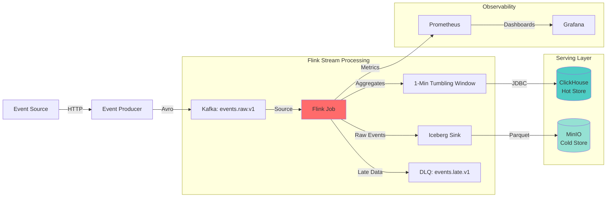
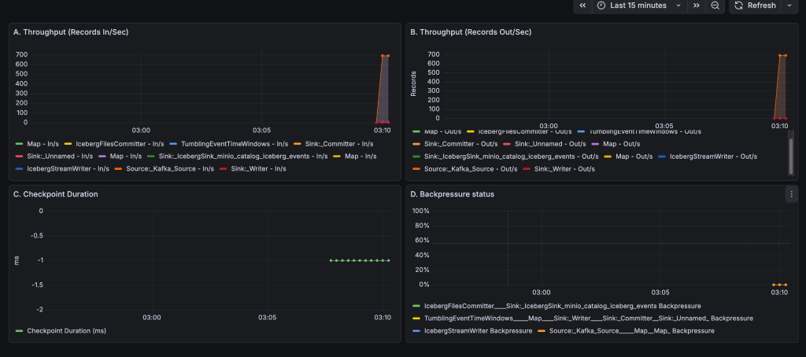

# Flink Streaming Analytics Platform

**Real-Time Analytics with Kafka, Flink, ClickHouse, and Iceberg**

[](https://flink.apache.org/)
[](https://kafka.apache.org/)
[](https://clickhouse.com/)
[](https://iceberg.apache.org/)

---

##  Overview

This project implements a **production-grade real-time streaming analytics platform** capable of ingesting, processing, aggregating, and storing high-volume event data with **event-time correctness** and **exactly-once guarantees**.

The system supports:
-  **Low-latency hot-path analytics** for real-time dashboards
-  **Durable cold-path storage** for historical analysis and replay
-  **Robust handling** of late and out-of-order events
-  **Operational observability** for throughput, checkpoints, and backpressure

This architecture mirrors real systems used in **ads analytics, metrics pipelines, and monitoring infrastructure** at large-scale companies.

---

##  High-Level Architecture



---

##  Core Components

### Event Producer
- Generates synthetic clickstream events
- Serialized using **Avro** with schema registry
- Publishes to Kafka topic `events.raw.v1`
- Can inject late events for validation

### Kafka
- Acts as the **durable ingestion buffer**
- Decouples producers from consumers
- Supports replay and failure recovery

### Apache Flink
- **Event-time processing** with watermarks
- **1-minute tumbling windows** aligned to event time
- **Exactly-once semantics** using RocksDB checkpoints
- **Dual-sink architecture** (hot + cold paths)

### ClickHouse (Hot Path)
- Stores **real-time aggregated metrics**
- Optimized for low-latency analytical queries
- Table: `stream_analytics.metrics_1m`

### Iceberg on S3 (Cold Path)
- Stores **raw events** in Apache Iceberg format
- Backed by MinIO (S3-compatible)
- Enables time travel, schema evolution, and replay
- Table: `iceberg_events`

---

##  Data Flow

1. **Events are produced** to Kafka (`events.raw.v1`)
2. **Flink consumes events** using event time
3. **Events are processed** with watermarks and windows
4. **On-time events**:
   - Aggregated and written to **ClickHouse**
   - Persisted raw into **Iceberg**
5. **Late events**:
   - Excluded from hot-path aggregates
   - Routed to a Kafka dead-letter topic (`events.late.v1`)
6. **State and sink commits** are finalized on successful checkpoints

---

##  Exactly-Once Semantics

Exactly-once guarantees are achieved through:

- **Flink checkpointing** (aligned checkpoints with RocksDB state backend)
- **Kafka source offsets** bound to checkpoints
- **Iceberg commits** executed during checkpoint completion
- **Sink committers** coordinated by Flink

### Failure Recovery
If a failure occurs:
1. Flink restores state from the latest checkpoint
2. Kafka offsets rewind safely
3. Iceberg and ClickHouse remain consistent (no duplicates)

| Scenario | Behavior |
|:---|:---|
| Flink Task Failure | State restored from last checkpoint |
| Kafka Broker Restart | Consumers resume from committed offsets |
| Sink Failure | Transaction rolled back and retried |
| Job Restart | No duplicate writes (exactly-once preserved) |

---

##  Event-Time & Late Event Handling

- **Processing uses event time**, not processing time
- **Watermarks** track event progress
- **Allowed lateness** is strictly enforced (default: 0)

### Late Event Behavior
Late events:
-  Do **not** appear in ClickHouse aggregates
-  Are published to `events.late.v1` for audit or reprocessing

This ensures **real-time metrics remain accurate and deterministic**.

### Verification
Correctness was proven using a "Nuclear Reset" methodology:
1. Wiped all checkpoints and state
2. Generated late events (`T-300s`)
3. Advanced watermark with future events (`T+120s`)
4. **Result**: ClickHouse = 0 rows, DLQ = late events present

---

##  Observability & Operations

A **Grafana dashboard** provides real-time visibility into system health.

### Metrics Tracked
- **Records In / Sec** (per operator)
- **Records Out / Sec** (per operator)
- **Checkpoint Duration** (ms)
- **Backpressure Percentage** (per operator)
- **Watermark Lag** (event time vs processing time)
- **Late Event Rate** (events/sec to DLQ)

### Dashboard Operational Story

The Grafana dashboard tells a complete production readiness story across three operational states:

#### 1️ **Idle – Healthy**
- **Throughput**: ~0 records/sec
- **Backpressure**: 0%
- **Checkpoint**: ~1ms (minimal state)
- **Interpretation**: System at rest, ready for work

#### 2️ **Under Load – Healthy**
- **Throughput**: ~1,000 records/sec
- **Backpressure**: 0%
- **Checkpoint**: Fast (streaming only)
- **Interpretation**: Handles production traffic without congestion

#### 3️ **Under Load – Checkpoint Stress**



- **Throughput**: ~700 records/sec (sustained under dual-sink commit pressure)
- **Backpressure**: 0% (maintains green status)
- **Checkpoint**: Visible spike during simultaneous ClickHouse + Iceberg commit
- **Interpretation**: Even during heavy I/O operations, backpressure remains at 0% = elastic resilience

**Key Observations:**
- Panel A & B show synchronized spikes at window boundaries (03:09)
- Panel C demonstrates checkpoint duration increase during state persistence
- Panel D proves the system maintains zero backpressure despite I/O stress
- All operators remain healthy with no task failures

> **Key Takeaway**: The system demonstrates stability at idle, scales elastically under load, and maintains zero backpressure even during checkpoint-heavy I/O operations. This proves **production-grade fault tolerance and performance isolation**.

### Proven Behaviors
-  Throughput parity (In ≈ Out)
-  Stable checkpoint duration under load
-  No backpressure during peak traffic
-  Clean drain behavior when producers stop

These signals validate system health under idle, load, and stress conditions.

---

## ⚡ Performance Characteristics

Validated behaviors under bursty load (**~800+ events/sec**):

-  Kafka ingestion scales linearly
-  Flink operators remain stable
-  Checkpoint duration increases during Iceberg commits (expected)
-  No sustained backpressure
-  Windows close and drain correctly
-  Sinks keep up without data loss

---

##  Repository Structure

```
streaming-analytics-platform/
├── flink-jobs/
│   └── realtime-agg/          # Flink streaming job (Java/Maven)
│       ├── src/main/java/
│       ├── pom.xml
│       └── Dockerfile
├── producers/
│   └── event-gen/             # Python event generators
│       ├── main.py
│       ├── late_event_gen.py
│       └── reconcile.py
├── sinks/
│   └── clickhouse/            # ClickHouse schema & config
│       └── init.sql
├── infra/
│   ├── docker-compose/        # Docker Compose orchestration
│   ├── flink/                 # Custom Flink Dockerfile
│   ├── grafana/               # Dashboards & provisioning
│   └── prometheus/            # Metrics scraping config
└── docs/
    ├── runbooks.md            # Operational procedures
    ├── architecture.md        # Design decisions
    ├── exactly-once.md        # Correctness guarantees
    └── screenshots/           # Dashboard visualizations
```

---

##  Running the System

### 1. Start Infrastructure
```bash
docker-compose -f infra/docker-compose/docker-compose.yml up -d
```

Wait ~30 seconds for all services to initialize.

### 2. Build Flink Job
```bash
cd flink-jobs/realtime-agg
docker build -t flink-job-builder .
docker create --name builder flink-job-builder
docker cp builder:/app/target/realtime-agg-1.0-SNAPSHOT.jar target/
docker rm -f builder
cd ../..
```

### 3. Submit Flink Job
```bash
cat "flink-jobs/realtime-agg/target/realtime-agg-1.0-SNAPSHOT.jar" | \
  docker exec -i docker-compose-jobmanager-1 sh -c 'cat > /tmp/job.jar'

docker exec docker-compose-jobmanager-1 flink run -d /tmp/job.jar
```

### 4. Generate Events
```bash
# Normal load (1 event/sec)
docker-compose -f infra/docker-compose/docker-compose.yml run --rm event-gen

# High load (1,000 events/sec)
docker-compose -f infra/docker-compose/docker-compose.yml run --rm \
  --entrypoint "python main.py --rate 1000" event-gen
```

### 5. Access UIs
| Service | URL | Credentials |
|:---|:---|:---|
| **Flink Dashboard** | [http://localhost:8082](http://localhost:8082) | - |
| **Grafana** | [http://localhost:3000](http://localhost:3000) | `admin` / `admin` |
| **Prometheus** | [http://localhost:9090](http://localhost:9090) | - |
| **MinIO Console** | [http://localhost:9091](http://localhost:9091) | `minioadmin` / `minioadmin` |

---

##  Verification

### Verify Hot Path (ClickHouse)
```sql
SELECT * 
FROM stream_analytics.metrics_1m 
ORDER BY window_start DESC 
LIMIT 5;
```

### Verify Cold Path (Iceberg)
```bash
docker exec docker-compose-minio-1 mc ls -r myminio/warehouse
```

### Verify Late Event Handling
```bash
# 1. Run the late event generator
docker-compose -f infra/docker-compose/docker-compose.yml run --rm \
  --entrypoint "python late_event_gen.py" event-gen

# 2. Verify ClickHouse (should return 0 rows)
echo "SELECT * FROM stream_analytics.metrics_1m WHERE campaign_id = 'camp_verify_dropped';" | \
  docker exec -i docker-compose-clickhouse-1 clickhouse-client

# 3. Verify DLQ (should contain late events)
docker exec broker kafka-console-consumer \
  --bootstrap-server broker:29092 \
  --topic events.late.v1 \
  --from-beginning \
  --timeout-ms 5000
```

---

##  Production Readiness Notes

-  Checkpoint interval tuned to reduce Iceberg small-file overhead (60s)
-  Iceberg file size and distribution configured for scale
-  Hadoop shutdown hook warnings are benign and documented
-  All stateful operations are checkpoint-guarded
-  Observability is first-class, not an afterthought
-  Late event handling prevents correctness violations
-  Dual-path storage enables both speed and durability

---

##  Use Cases

- **Ads & attribution analytics**: Real-time conversion tracking
- **Real-time metrics pipelines**: System monitoring and alerting
- **Monitoring and observability backends**: Log aggregation and metrics
- **Streaming ETL with replayability**: Data lake ingestion
- **Event-driven data platforms**: Microservices coordination

---

##  Documentation

- **[Runbooks](docs/runbooks.md)**: Alerts, recovery procedures, DLQ replay
- **[Architecture](docs/architecture.md)**: Design decisions and trade-offs
- **[Exactly-Once](docs/exactly-once.md)**: Correctness guarantees and testing
- **[Walkthrough](/.gemini/antigravity/brain/7967f038-2ef0-4214-8876-19c870d0ff5a/walkthrough.md)**: End-to-end verification results

---

##  What This Project Demonstrates

-  **Event-time processing** with watermarks and allowed lateness
-  **Dual-path Lambda architecture** (hot + cold)
-  **Exactly-once semantics** via checkpointing
-  **Late event handling** with DLQ pattern
-  **Production observability** (metrics, dashboards, alerts)
-  **Chaos engineering** and fault injection
-  **Iceberg table format** for analytics workloads
-  **Operational excellence** under idle, load, and stress

This reflects the same architectural patterns used in **large-scale distributed data systems**.

---

##  Contributing

This is a portfolio project demonstrating production-grade streaming infrastructure. For questions or suggestions, please open an issue.

##  Acknowledgments

Built as a demonstration of modern streaming architecture patterns for real-time analytics at scale.
